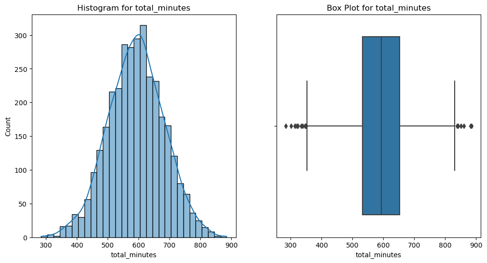

# SyriaTel Customer Churn

SyriaTel, a telecommunications company, is grappling with customer churn, a challenge faced by many businesses in the industry. The pressing issue is the financial impact of customers discontinuing their services, leading to revenue loss and potentially hindering the company's growth. To address this concern, the company seeks to leverage machine learning to build a classifier that predicts whether a customer is likely to churn in the near future. The goal is to identify patterns and factors contributing to customer attrition, enabling proactive retention strategies.

## Overview

The company is finding itself at a crossroads - they are losing a surprising amount of customers and they are not sure why. They need to know well in advance how many more customers they are likely to lose, in order to not only get their financials in order, but to brace for a worst case scenario in the event that that happens.

## Business Understanding

Syriatel is a well-known telecommunications company in Syria that was founded in 2000. It provides mobile phone and internet services, and is an important player in the country's telecom market. Syriatel competes in a dynamic market with a large subscriber base, concentrating on technology developments such as developing 4G services. The corporation operates in a regulated environment, overcoming technological, regulatory, and market competitive issues. Corporate social responsibility is almost certainly one of its objectives.

## Data Understanding

A dataset was provided by the company, which gave sample customers and a host of what they deemed as relevant information. The data was analysed in order to establish the basics of the resultant dataframe, such as the shape, number of non-null values and columns present in the dataset.

A few visualisations were also given to give a quick insight into how some of the features would relate with each other as seen below.

;

## Data Preparation

Various steps were carried out here, starting with the identification of outliers in the dataset. After much back and forth, it was deemed that the outliers were still necessary as these outliers considered extremities due to the political situation in that region.

Furthermore, there were columns that had been identified to carry similar data in them. The data may not be the exact same thing, but it was deemed fairly similar such that these features did not warrant their own columns. As such, the `preprocess` method that is part of the DataPreProcessing class was called to combine the relevant columns into one and include them in the original dataframe.

Afterwards, an EDA was conducted to graphically show the relationship between different variables. The statistical methods used to carry out the EDA are the univariate analysis, and the bivariate analysis (with a particular focus on the churn).

## Modelling

Now that the EDA was completed, modelling could begin. Data PreProcessing was carried out first, ensuring to `label_encode` columns with categorical, boolean and discrete data.

Afterwards, a train-test split of the data was carried out, observing a 80-20 split of data, with 20% of data being taken for testing. Within this process, stratification of the data was also done to ensure proportionality in both training and testing data sets.

Next on the scheduled list of actions was feature scaling, which ensuresd that the features can be scaled/ normalised as desired. Once this was done, the age old question of 'TO SMOTE OR NOT TO SMOTE' was faced, more particularly, at what point should one SMOTE - before or after the creation of the baseline model?

Upon further analysis, it was established that **in this instance**, conducting a SMOTE before or after the creation of the baseline model had no impact on the accuracy score. Thus, to reduce steps taken, the SMOTE was done before the creation of the baseline model.

The baseline model - a logistic regression, was created, followed by a decision tree model (2nd model), which was then followed by a random forest model (3rd model). Hyperparamter tuning of the random forest model was done afterwards, leading to the creation of our 4th model.

|                       | Accuracy | Precision | f1     | Recall |
| --------------------- | -------- | --------- | ------ | ------ |
| Logistic Regression   | .857571  | .52941    | .27481 | .18557 |
| Decision Tree         | .89355   | .64130    | .62434 | .60825 |
| Random Forest         | .93103   | .93220    | .70513 | .56701 |
| Hyperparameter Tuning | .94003   | .98305    | .74359 | .59794 |

## Evaluation

Among the evaluated machine learning models, logistic regression exhibits moderate accuracy, yet it faces challenges in correctly identifying instances of the positive class, as reflected in its lower recall for class 1. Conversely, the decision tree demonstrates good overall accuracy with balanced precision and recall for both classes, though caution is warranted due to the potential for overfitting, as suggested by its high accuracy on the training set. In contrast, the random forest model boasts high accuracy but grapples with lower recall for class 1, indicating a potential struggle in recognizing all positive instances. Through hyperparameter tuning specifically applied to the random forest, a slight improvement in accuracy is achieved, accompanied by enhanced precision, recall, and F1-score for class 1, signaling a refinement in the model's ability to correctly identify positive instances compared to its untuned counterpart. These insights underscore the nuanced performance characteristics of each model and highlight the impact of hyperparameter optimization on enhancing the random forest's efficacy in handling the positive class.

# Conclusion

In assessing the models for predicting customer churn, it is evident that each has its strengths and limitations. Logistic regression, while demonstrating moderate accuracy, may struggle in correctly identifying instances of customers who are likely to churn, as indicated by its lower recall for class 1. The decision tree shows good overall accuracy and balanced precision and recall for both classes, making it a promising choice, but the potential for overfitting needs careful consideration. On the other hand, the random forest, with its high accuracy, faces challenges in recognizing all instances of customer churn, particularly reflected in its lower recall for class 1.

However, a noteworthy finding emerges with the application of hyperparameter tuning to the random forest model. This refinement results in a slight improvement in overall accuracy and notably enhances precision, recall, and F1-score for the positive class. This suggests that, with proper tuning, the random forest can be optimized to better identify customers at risk of churning. **This model can thus, be viewed as the model that will predict churn with the highest precision/ accuracy and correctness.**
